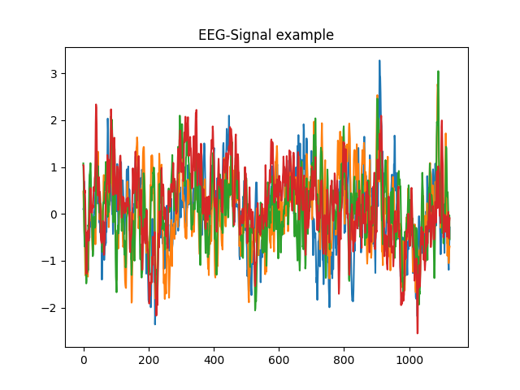

# Exercise: Brain-Wave decoding with Convnets

In this exercise we will apply CNN to decode Brain-Wave or EEG data.
The data-set was recorded at the University of Freiburg and appeared in [Deep learning with convolutional neural networks for EEG decoding and visualization](https://onlinelibrary.wiley.com/doi/10.1002/hbm.23730).
The authors describe it as follows:

"Our “High-Gamma Dataset” is a 128-electrode dataset of which we later only use 44 sensors covering the
motor cortex, (see Section 2.7.1), obtained from 14 healthy subjects (6 female, 2 left-handed, age $27.2\pm3.6$
(mean $\pm$ std)) with roughly 1000 ($963.1\pm150.9$, mean $\pm$ std) four-second trials of executed movements divided
into 13 runs per subject. The four classes of movements were movements of either the left hand, the right
hand, both feet, and rest (no movement, but same type of visual cue as for the other classes)."


### Setting up dependencies
Let's set up a conda environment for this exercise.
Assuming conda is installed, please run:

```bash
conda create --name braindecode python=3.9
```
Activate the environment:
``` bash
conda activate braindecode
```
Install the exercise dependencies:
``` bash
pip install -r requirements.txt
```

### Getting the data

The dataset is available [online](https://gin.g-node.org/robintibor/high-gamma-dataset). We have prepared a download script for you.
To get the data run
```bash
cd data
python download.py
```
Be patient. The script will take approximately an hour to complete.
Run `nox -s test` to check if the data-loading works properly.
The plot below shows the first four EEG sensors of a recording.



Examine the data yourself.

### Your task:
Train a CNN to recognize the four actions given only the EEG data.
Preprocessing code from the paper-authors is already ready for in `src/util.py`. To get started have a look at `src/train_brain_decoder.py` and load the data via:
```python
    from src.load_eeg import load_train_valid_test
    low_cut_hz = 0
    subject_id = 1

    train_filename = os.path.join('./data', 'train/{:d}.mat'.format(subject_id))
    test_filename = os.path.join('./data',
                            'test/{:d}.mat'.format(subject_id))

    # Create the dataset
    train_set, valid_set, test_set = load_train_valid_test(
        train_filename=train_filename, test_filename=test_filename,
        low_cut_hz=low_cut_hz)

```

Use as much of your code from the last two days as possible. You can re-use your image-processing code treating the EEG signals as tensors with and 44 "color"-channels and a time dimension. Implement your solution in `src/train_brain_decoder.py`. Implement everything marked with a `TODO`.

What happens if you train and test on two different study-participants?
